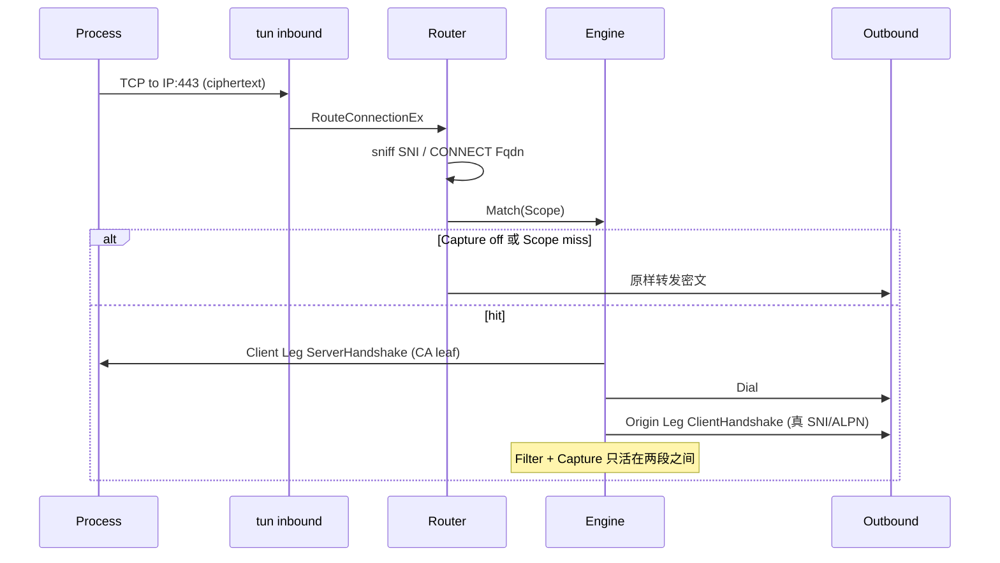

# MITM / Capture Design

本机调试用. 解决 TUN/mixed 上看不见匹配域名的 TLS 明文. 不是 C 端产品, 默认关. 进程匹配延期.

相关: `CONTEXT.md`, `docs/adr/0001-mitm-as-engine.md`, `docs/adr/0003-domain-scoped-v1.md`.

## 问题

TUN 入站拿到的是 5-tuple + 密文. `sniff` 只能读 ClientHello SNI, 不能解密. 选完 Outbound 之后, Origin 方向转发的仍是同一段密文. 所以:

- 入站侧(本地 -> tun/mixed): 看得见 IP 或 CONNECT 名, 看不见明文
- 出站侧(sing-box -> 目标): 如果没拆 Client Leg, 也看不见明文

两段不是同一个 TLS. 不能共用一份 `inbound.tls` / `outbound.tls`.



## 职责切分

| 概念 | 负责 | 不负责 |
|---|---|---|
| tun / mixed Inbound | 收包, 填 Source/Destination | 不出假证, 不解密 |
| Router | sniff, 找 ConnectionOwner, 选 Outbound | 不持有 CA, 不跑 Filter |
| Engine | Capture 开关, Scope, Filter, 签 leaf, 拆 Client Leg, 建 Origin Leg | 不是 Inbound, 不改路由表 |
| Outbound | 把 Origin Leg 的 TCP 送出去 | 不再对同一条流做第二次 MITM |

## Scope

运行时注册, 热路径读 snapshot. v1 只按域名, 不按进程.

```json
{
  "id": "ex",
  "domain": ["api.example.com"],
  "domain_suffix": ["example.com"]
}
```

匹配顺序:

1. `Capture == false` -> 不拆
2. 没有任何 Scope -> 不拆 (默认闭)
3. 没有 SNI 且没有 CONNECT Fqdn -> 不拆, 不对 IP 乱签
4. 域名不中任何 Scope -> 不拆
5. 否则 terminate Client Leg

`domain` / `domain_suffix` 至少要有一个. 禁止空 Scope. 禁止 `*.*`.
ConnectionOwner 这轮不做匹配键. 现成 `find_process` 仍可用于普通路由规则, 与 Engine 无关.

## 两段 TLS

### Client Leg

- 角色: Engine 当 server, 进程当 client
- 证书: Capture CA 签 SNI; 无 SNI 则用 Destination.Fqdn; 再没有就跳过, 不对 IP 乱签
- ALPN: 跟 ClientHello
- 前提: 该进程信任 Capture CA. 钉扎进程会失败, 从 Scope 里拿掉
- 数据来源: TUN 的 CachedConn 里已有 ClientHello, 直接 `tls.Server`

### Origin Leg

- 角色: Engine 当 client, 真站当 server
- 用 Router 已经选好的 Outbound 当 Dialer, 再 `tls.Client` (可 uTLS)
- SNI/ALPN 复用 Client Leg 看到的值
- `insecure` 只允许调试显式打开, 默认校验证书
- 禁止再走一遍 Engine.Match

mixed/HTTP CONNECT 也走同一 Engine. Destination.Fqdn 在 CONNECT 时已有, 仍按域名匹配; 无 Fqdn 再 sniff SNI.

## Filter 与可见性

只作用在两段 TLS 之间的 HTTP 消息.

v1:

- `header`: 请求/响应增删改头
- `block`: 短路, 不建或不写 Origin Leg
- `when`: host / path_prefix / method, 空则全中

Capture 开着时, 匹配 Session 的请求行 + header 进 ring, 并推 WS. body 默认丢, 上限以后再加. 关 Capture: 新连接不再拆 Client Leg, 在途 Session 不回溯.

没有 Filter 且调用方不要事件时, 仍必须拆两段 TLS 才能看到明文; 中间可以是 L4 copy, 不上 HTTP 解码. 一旦有 Filter 或要推 HTTP 事件, 才上 h1. h2 第二刀.

## 控制面

Engine 进程内单例. HTTP 挂现有 clashapi, 与 Go 接口同一张表.

```
GET    /mitm
PATCH  /mitm                 {"enabled": true}
GET    /mitm/ca
POST   /mitm/scopes
DELETE /mitm/scopes/{id}
POST   /mitm/filters
DELETE /mitm/filters/{id}
GET    /mitm/sessions
GET    /mitm/capture         WS
```

`enabled` 就是 Capture. 不提供 "仍拆 TLS 但不记录" 的第二开关.

冷启动至少配 CA. `enabled` / `scopes` 是种子, 只在 Start 灌进内存, 不回写 JSON. Filter 仍只走 API.

```json
{
  "mitm": {
    "auto_generate": true,
    "certificate_path": "mitm-ca.crt",
    "key_path": "mitm-ca.key",
    "enabled": true,
    "scopes": [
      {"id": "google", "domain": ["www.google.com", "google.com"]},
      {"id": "x", "domain": ["x.com", "www.x.com"]}
    ]
  }
}
```

不写 `enabled` 则启动 Capture off. 运行时仍用 `PATCH /mitm` 和 `POST /mitm/scopes` 改, 重启后回到种子.

## 必须同时做的旁路

- 不依赖 `find_process`
- 命中 Scope 的 QUIC: Bypass + warning, 不 reject, 代理必须成功
- FakeIP: 先还原域名再签 leaf
- ECH / 证书钉扎 / mTLS: Scope 未命中或握手失败则原样失败, 不做静默 fallback

## 非目标 (v1)

- 动态 `inbound.Create`
- 整份 config reload 当开关
- 脚本 Filter
- 把 Origin Leg 再 MITM 一次
- 按 `*.*` 全局拆
- 给终端用户做 CA 安装向导
- 改写在途 Session 的 TLS

## 实现切片

1. `common/mitm`: Engine, CA, Scope snapshot, Capture 开关
2. `route/route.go`: sniff 之后 Hook; 命中走 `Engine.Intercept`
3. `experimental/clashapi/mitm.go`: 上面那组 API
4. Client Leg + Origin Leg + L4 copy, 日志打 SNI/process
5. h1 解码 + header/block + WS 推请求行和 header

验收: 注册 `domain_suffix=example.com`, Capture on, TUN 或 mixed 访问该域名, WS 看到明文请求行和 header; Capture off 后新连接只剩密文.


## 已锁定 (给夜间 agent)

- Q5=禁止空域名, Q6=多 Scope 并存, Q7=TUN 主验收, Q8=Bypass+warning, Q9=先 h1 再 h2 不做 h3, Q10=不落盘

- 场景: 本机调试, 默认 Capture off
- 主路径: TUN. mixed 走同一 Engine, 但验收只看 TUN
- Scope: 域名必填, 多条并存, 任一命中. 无进程字段
- Capture 开: 拆匹配域名的 TCP Client Leg, 推请求行 + header
- Capture 关: 新连接不拆
- 明文解码优先级: HTTP/1.1 先做满, 再解 HTTP/2 stream. HTTP/3 不做, QUIC 一律 Bypass+warning
- QUIC / 无 SNI: Bypass + warning, 不准为了抓包把连接打掉
- Filter v1: `header` + `block` (先打在 h1 上, h2 接上同一套 Filter)
- CaptureState 纯内存, 重启丢失
- 控制面: clashapi `/mitm*` + 进程内接口
- CA: `auto_generate` + path
- 不要动态 inbound, 不要 config reload, 不要脚本


## 本机环境约束 (夜间 agent 必读)

本机 TUN 由人关掉, agent 不要自己 `launchctl unload` / 杀 pid. 关 TUN 之后出网走下面这路 HTTP 代理, 不要再起一份 WIP tun.

- 代理: `http://lewis.home.linran.top:1088`
- 探活: `curl -I https://www.google.com --proxy 'http://lewis.home.linran.top:1088'`
- 环境变量 (bash, 会话级, 不要写进仓库配置, 不要碰 `.env`):

```bash
export http_proxy='http://lewis.home.linran.top:1088'
export https_proxy='http://lewis.home.linran.top:1088'
export HTTP_PROXY="$http_proxy"
export HTTPS_PROXY="$https_proxy"
export ALL_PROXY="$http_proxy"
export no_proxy='localhost,127.0.0.1,::1,.home.linran.top'
export NO_PROXY="$no_proxy"
```

- `go` 模块下载走同一代理即可, 不要改 `GOPROXY` 除非直连 `proxy.golang.org` 失败
- 现网 daemon 仍可能在: `system/top.linran.sing-box.tun` -> `/Users/linran/go/bin/sing-box`, 配置在 `/usr/local/etc/sing-box`. 禁止覆盖该二进制, 禁止读改该目录, 禁止用 WIP 接管 utun

| 动作 | 是否允许 |
|---|---|
| `just build` / `go build -o ./sing-box` | 允许 |
| 给 curl/go 设上面的 proxy | 允许, 关 TUN 后必做 |
| `just install` / 覆盖 `~/go/bin/sing-box` | 禁止 |
| 再 `run` 一份带 tun 的配置 | 禁止 |
| `launchctl unload/kick` | 禁止, TUN 由人关 |
| `go test ./...` 起 tun | 禁止 |
| 读 `/usr/local/etc/sing-box` | 禁止 |

验收用 unit 或临时 mixed listen localhost. 真 TUN 留给人手工切.

## 夜间实施切片 (做到绿才停)

1. option + Engine 单例 + CA 签发/缓存 leaf
2. Router 在 sniff 之后 Hook, 只对 TCP TLS 命中 Scope 走 Intercept
3. Client Leg `tls.Server` + Origin Leg `tls.Client` (用已选 Outbound Dialer)
4. clashapi: GET/PATCH `/mitm`, scopes CRUD, GET `/mitm/ca`
5. h1 解码 + WS `/mitm/capture` 推 method/path/headers; 随后同一路径解 h2 stream, 接到同一套 Filter. 不碰 h3
6. QUIC 命中 Scope: Bypass + warning
7. 本地自检: 配置 TUN 或至少用 unit/integration 证明 Match/Intercept/开关; 编译通过

验收: 注册 `domain_suffix`, Capture on, TUN 上该域名 HTTPS(h1) 能看到明文请求行和 header; 同域 QUIC 仍能通, 日志有 Bypass warning; Capture off 后新连接不再拆.


## 怎么看明文

主路径是 clashapi websocket, 不是日志. 当前 `macos-tun.json` 的 `log.level` 是 `warn`, intercept 的 SNI 行在 `info`, 明文请求行/header 只走 WS.

1. 用带 MITM 的二进制跑 workspace 这份 `macos-tun.json`. 不要用 launchd 那个旧 `/Users/linran/go/bin/sing-box`.
2. 信任 cwd 下 `mitm-ca.crt`, 或 `GET http://127.0.0.1:19090/mitm/ca`.
3. 订阅 `ws://127.0.0.1:19090/mitm/capture`. 形状见 `experimental/clashapi/mitm.http`.
4. 事件只有请求行 + header, 不落盘, 不带 body.
5. 只拆 `www.google.com` / `google.com` / `x.com` / `www.x.com`. Chrome 默认 HTTP/3 会 Bypass+warning, 用 `curl --http1.1` 或关掉 QUIC.

```bash
just build
# 旧 TUN 由人先关. 这份配置自己会起 tun inbound, 需要和原来一样的权限.
./sing-box run -c macos-tun.json

# 另开终端
curl -sS http://127.0.0.1:19090/mitm
# 用 websocat / mitm.http 订 WS, 再打流量
curl --http1.1 --cacert mitm-ca.crt https://www.google.com/ -o /dev/null
curl --http1.1 --cacert mitm-ca.crt https://x.com/ -o /dev/null
```

`/usr/local/etc/sing-box/macos-tun.json` 需要 root, agent 不写. 要用那份就自己拷 workspace 里的 `mitm` 段.
